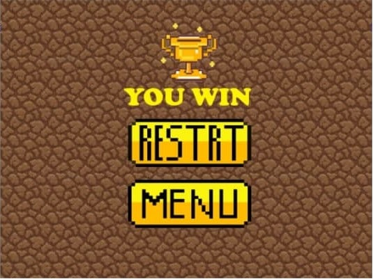
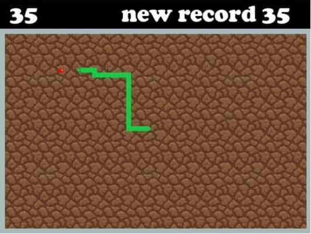
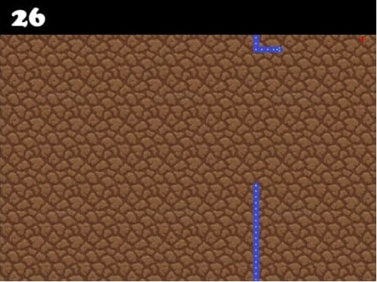
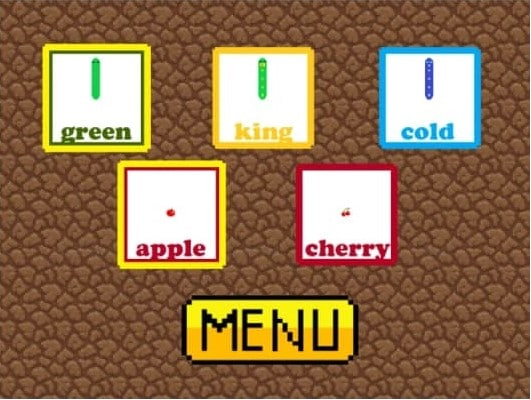

# SnakeGame
Данный проект под названием «Змейка» представляет собой развлекательное приложение. Возрастных ограничений нет. В нем пользователь может сыграть за всем известную ненасытную змейку.

Управление происходит следующим образом:
*	W, A, S, D — вверх, влево, вниз, вправо соответственно
*	Также можно управлять стрелками на клавиатуре 
*	ESC — пауза
*	Все кнопки нажимаются при помощи мыши 

Имеются разные режимы. Выбрав режим выживание, пользователь может ставить свои рекорды и даже пройти до конца.

Но будет ли ему это под силу, ведь в этом режиме придется уворачиваться от стен и не прикасаться к своему хвосту. 

Если этот режим слишком сложен или вы просто хотите размеренно насладиться игрой, то предлагаю вам выбрать обычный режим. 

Там нельзя проиграть, ведь стены отсутствуют, и неведанная магическая сила телепортирует змейку на противоположную сторону, а собственный хвост на своем пути змейка беспощадно перекусывает, стремясь только вперед, к новым рекордам. Если внешний вид змейки вам не понравиться, вы можете даже с самого начала игры установить тот, который устраивает, не устанавливая большие рекорды и не собирая жадно монетки часами.

### Используемые технические средства
Программно-аппаратные требования: ОС — Windows, свободного пространства на жестком диске — не менее 72 Мb, оперативной памяти 256 Мb, объем разработки — 30 Мb.
### Требуемое программное обеспечение и подключаемые библиотеки
1.	Python v3.8
2.	Список требуемых библиотек:
*	«Pygame»
*	«sys»
*	«os»
*	«random»
*	«math»
